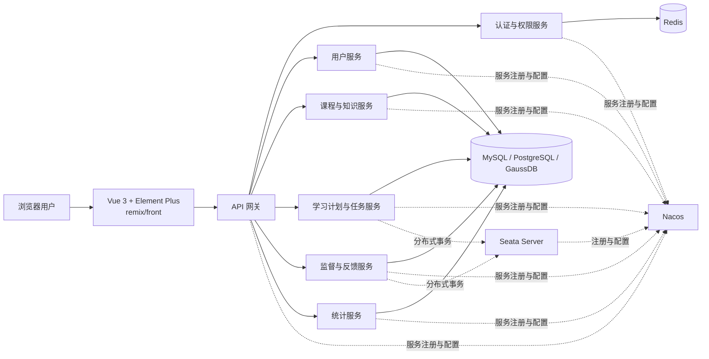

# 李佳霖与爸爸的 AI 学习库

## 项目介绍

这是一个用于记录、陪伴和监督李佳霖学习人工智能的成长型仓库，重点关注 AI Agent（智能体）与大语言模型相关知识。仓库将保存学习计划、实践代码、阅读笔记、问题思考和阶段总结，使每一次学习都有记录、有反馈，也能看到长期的进步。

本仓库不仅关注“如何使用 AI”，也重视理解 AI 的基本原理、能力边界和安全规范。学习过程中将通过讲解、提问、动手实践和复盘总结，逐步培养独立思考、主动探索和解决实际问题的能力。

## 主要学习内容

- 大语言模型的基本概念、工作方式与应用场景
- 提示词设计、上下文组织和模型结果评估
- AI Agent 的任务规划、工具调用、记忆与执行流程
- 使用 Python 开发简单的 AI 应用和智能体
- AI 使用中的事实核查、隐私保护、安全与责任意识
- 将所学知识应用到真实的小项目中

## 学习与监督方式

- 李佳霖负责完成学习任务、编写代码并记录自己的理解和问题。
- 家长负责协助制定阶段目标、检查学习进度并提供必要的引导。
- 每项学习内容尽量包含“目标、实践、结果、问题、复盘”五个部分。
- 监督以培养自主学习能力为目的，重视思考过程，不以代替完成任务为方式。
- 定期回顾学习记录，根据掌握情况调整后续计划。

## Remix 学习管理系统

### 项目位置与当前状态

`remix/` 是本仓库中的学习管理系统项目，采用前后端分离的微服务架构，用于在真实业务场景中练习需求分析、服务拆分、数据库设计、接口开发、前端开发、测试和部署。

| 路径 | 用途 | 当前状态 |
| --- | --- | --- |
| `remix/` | 学习管理系统项目根目录 | 已创建 |
| `remix/front/` | Vue 3 前端项目 | 目录已创建，功能待逐步实现 |
| `remix` 下的后端目录 | Spring Boot 微服务 | 待规划和创建 |

本节描述的是 Remix 的目标架构。尚未创建的目录和服务属于规划内容，不能视为已经完成；后续开发时应持续同步实际目录、启动命令、技术版本和完成状态。

### 建设目标

Remix 主要用于管理和监督完整的学习过程，可逐步实现以下功能：

- 学生、家长或监督人、教师和管理员等用户及权限管理。
- 课程、章节、知识点、学习资料和学习计划管理。
- 学习任务的创建、分配、提交、检查和完成状态跟踪。
- 学习过程记录、问题记录、反馈、复盘和监督提醒。
- 学习进度、任务完成率和阶段成果统计。
- AI Agent 和大语言模型实验的过程记录与结果评估。

采用微服务架构的目的是练习服务边界、独立部署、服务治理、缓存、多数据库适配和分布式事务。学习阶段应优先保证边界清晰和系统可运行，避免为了拆分而拆分。

### 总体架构



前端统一访问 API 网关，不直接访问具体微服务。网关和各微服务通过 Nacos 完成服务注册、发现和配置管理；确实存在跨服务强一致性要求时，再使用 Seata 协调分布式事务。

### 技术栈

| 层级 | 技术 | 主要用途 |
| --- | --- | --- |
| Java 运行环境 | JDK 17 或更高版本 | 后端编译和运行环境 |
| 后端框架 | Spring Boot 3.x | 构建 REST API 和微服务应用 |
| 微服务治理 | Nacos | 服务注册、服务发现和集中配置管理 |
| 分布式事务 | Seata | 协调必要的跨服务事务 |
| 前端框架 | Vue 3 | 构建前端页面和交互逻辑 |
| 前端组件库 | Element Plus | 表格、表单、弹窗、菜单等界面组件 |
| 前端位置 | `remix/front/` | 前端源码、依赖和构建配置的固定目录 |
| 关系型数据库 | MySQL、PostgreSQL 或 GaussDB | 保存用户、课程、任务和学习记录等持久化数据 |
| 缓存与临时数据 | Redis | 缓存、登录状态、验证码、幂等控制和必要的分布式协调 |

如果后续引入 Spring Cloud 或 Spring Cloud Alibaba，应根据 Spring Boot 3.x 选择兼容的依赖组合，并在 README 中记录实际使用的版本，不能只使用不受约束的 `latest` 版本。

### 建议目录结构

以下为目标目录结构。除 `remix/front/` 外，其余目录均为建议规划，应在模块真正创建后再更新状态：

```text
remix/
├── front/                         # Vue 3 + Element Plus 前端
├── gateway/                       # API 网关（规划）
├── services/                      # 后端业务微服务（规划）
│   ├── auth-service/              # 认证和权限服务
│   ├── user-service/              # 用户与组织关系服务
│   ├── course-service/            # 课程、知识点和学习资料服务
│   ├── study-service/             # 学习计划、任务和学习记录服务
│   ├── supervision-service/       # 检查、反馈和监督提醒服务
│   └── report-service/            # 统计与阶段报告服务
├── common/                        # 通用类型、异常和基础能力（规划）
├── deploy/                        # 本地及部署环境配置（规划）
└── docs/                          # 架构、接口和数据库文档（规划）
```

`common/` 只能保存真正稳定且跨服务复用的基础内容，不能把不同服务的业务模型全部放入公共模块，否则会使微服务重新耦合在一起。

### 建议的服务职责

| 服务 | 核心职责 | 不应承担的职责 |
| --- | --- | --- |
| API 网关 | 统一入口、路由、基础鉴权、限流和请求追踪 | 复杂业务逻辑和业务数据持久化 |
| 认证与权限服务 | 登录、令牌、角色、权限和访问控制 | 课程或学习任务业务 |
| 用户服务 | 学生、家长、教师、管理员和组织关系 | 登录令牌签发和课程内容管理 |
| 课程与知识服务 | 课程、章节、知识点和学习资料 | 学习任务执行状态 |
| 学习服务 | 学习计划、学习任务、提交记录和完成状态 | 用户认证和通用网关能力 |
| 监督与反馈服务 | 检查记录、评价、反馈、提醒和复盘 | 课程内容所有权 |
| 统计服务 | 聚合学习进度、完成率和阶段成果 | 修改其他服务的核心业务数据 |

服务之间应通过清晰的 API 或事件进行协作，不应直接连接并修改其他服务拥有的数据表。

### Nacos 与 Seata

Nacos 在系统中承担两类职责：

1. 服务注册与发现：网关和微服务启动后注册到 Nacos，调用方通过服务名发现目标实例。
2. 配置管理：集中保存不同环境的公共配置和服务配置，避免把环境地址、账号或密钥硬编码在源码中。

Seata 用于处理确实需要跨多个微服务保持一致的业务操作。例如，一个学习任务完成时，可能同时更新任务状态、监督记录和统计数据。使用时应遵守以下原则：

- Seata Server 和参与事务的微服务通过 Nacos 完成注册发现和配置管理。
- 优先使用单服务本地事务；只有无法通过合理服务边界解决时才使用分布式事务。
- 能够接受短暂不一致的统计或通知场景，优先考虑事件驱动和最终一致性。
- MySQL、PostgreSQL、GaussDB 使用的驱动、SQL 方言及所选 Seata 事务模式必须分别验证，不能假设完全兼容。
- 分布式事务失败时必须保留可追踪日志，并设计重试、补偿或人工处理方式。

### Redis 使用规范

Redis 可用于：

- 缓存访问频率高且允许短暂延迟的数据。
- 保存有明确有效期的登录状态、验证码或临时令牌。
- 接口幂等标识、短时间重复提交控制和必要的分布式锁。
- 学习提醒、排行榜或统计结果等可重建数据。

Redis 不能替代关系型数据库保存必须长期可靠存在的核心学习记录。缓存键应包含业务前缀并设置合理的过期时间，同时考虑缓存穿透、缓存击穿、缓存雪崩和数据一致性问题。

### 数据库兼容要求

系统允许根据学习或部署环境选择 MySQL、PostgreSQL（PGSQL）或 GaussDB。为了保持可切换性，应遵守以下约束：

- 业务服务只访问自己负责的数据库或 Schema，禁止跨服务直接联表。
- 表名、字段名、索引名和约束名使用统一命名规则。
- 尽量使用标准 SQL；必须使用数据库专有语法时，应隔离实现并补充说明。
- 分页、自增主键、JSON、日期时间、布尔值和批量写入等差异需要单独测试。
- 数据库变更必须通过版本化迁移脚本管理，不能只在本地手工修改。
- 每种宣称支持的数据库都应具有建表、迁移和核心业务流程的验证记录。
- 数据库连接信息通过环境变量或配置中心提供，不得将真实密码提交到 Git。

### 前端约定

前端固定放在 `remix/front/`，采用 Vue 3 和 Element Plus。开发时应遵守以下原则：

- 使用 Vue 3 Composition API 组织页面状态和可复用逻辑。
- 页面只通过网关提供的 API 获取和修改数据，不直接连接数据库或后端微服务端口。
- API 请求、错误处理、登录失效处理和权限判断采用统一封装。
- Element Plus 组件样式应通过统一主题或公共样式管理，避免每个页面重复覆盖。
- 表单必须包含必填、格式和长度校验；表格必须处理加载、空数据、失败和分页状态。
- 前端环境配置区分开发、测试和生产环境，不提交真实密钥。

### 推荐启动顺序

本地开发环境完成后，建议按以下顺序启动：

1. 启动选定的关系型数据库。
2. 启动 Redis。
3. 启动 Nacos。
4. 启动 Seata Server，并确认其已注册到 Nacos。
5. 启动各业务微服务。
6. 启动 API 网关并检查服务路由。
7. 在 `remix/front/` 中启动 Vue 3 前端。

每个新增服务都应在自己的目录中提供环境要求、配置项、启动命令、健康检查地址和依赖服务说明。

### 开发与验收原则

- 新功能先明确所属服务和数据所有权，再编写代码。
- 接口应定义请求参数、响应结构、错误码和权限要求。
- 所有服务必须提供健康检查，并能够从日志中追踪一次请求经过的服务。
- 跨服务调用需要设置超时，不允许无限等待。
- 数据库、Redis、Nacos 和 Seata 不可用时，应返回可识别的错误并记录原因。
- 前后端功能完成后，至少验证正常流程、权限不足、参数错误、重复提交和依赖服务异常。
- 架构、目录、启动方式或技术版本发生变化时，必须同步更新本 README。

## 使用语言与校验规范

目前仓库支持校验以下三类代码：

| 类型 | 常用文件格式 | 最低校验要求 |
| --- | --- | --- |
| Python | `.py` | 代码格式、语法检查和必要的测试 |
| Java | `.java` | 代码格式、编译检查和必要的测试 |
| 前端 | `.html`、`.css`、`.js`、`.ts`、`.vue` | 代码格式、语法或类型检查，以及必要的构建测试 |

- 提交代码时，应使用与编程语言对应的文件扩展名和代码格式。
- 使用上述范围之外的编程语言时，必须同时编写该语言对应的校验脚本，至少覆盖代码格式和语法或编译检查；具备测试条件时还应运行测试。
- 校验脚本应能够直接执行，并在发现错误时返回非零退出状态，便于人工检查和自动化工具判断结果。
- 不包含可执行代码的学习笔记、计划、总结和其他纯文本内容，统一使用 Markdown 格式并保存为 `.md` 文件。
- Markdown 中包含代码示例时，应使用带语言标识的代码块，例如 `python`、`java`、`javascript` 或 `typescript`。

### 统一代码校验脚本

校验脚本固定放在仓库的 `scripts/check_code.py`。它适用于以下位置：

- 在仓库根目录中执行时，可以使用相对路径调用，默认检查整个仓库。
- 在仓库的任意子目录或仓库外执行时，可以使用脚本的绝对路径调用。
- Python 代码或前端项目不在仓库根目录时，可以在命令末尾传入要检查的文件或目录。

首次执行 Python 校验前，需要在当前 Python 环境安装 `pylint`：

```bash
python -m pip install pylint
```

前端项目需要已经安装 `pnpm` 和项目依赖，并在 `package.json` 的 `scripts` 中提供 `lint`、`type-check`、`format`、`build` 四个命令。前端校验会依次运行：

```bash
pnpm lint
pnpm type-check
pnpm format
pnpm build
```

在仓库根目录检查全部 Python 文件：

```bash
python scripts/check_code.py python
```

检查指定的 Python 文件或目录：

```bash
python scripts/check_code.py python path/to/file_or_directory
```

在仓库根目录检查前端项目；如果目标目录中没有直接包含 `package.json`，脚本会查找其下的前端项目：

```bash
python scripts/check_code.py frontend
```

检查指定的前端项目目录：

```bash
python scripts/check_code.py frontend path/to/frontend_project
```

一次检查目标中的 Python 和前端项目：

```bash
python scripts/check_code.py all
python scripts/check_code.py all path/to/project
```

从任意工作目录调用时，使用脚本和检查目标的绝对路径。例如：

```powershell
python D:\path\to\repository\scripts\check_code.py frontend D:\path\to\frontend-project
```

任意一项检查失败、依赖未安装、目标不存在或前端命令缺失时，脚本都会返回非零退出状态。

## Git 分支与合并规范

### 新建工作分支

刚加入项目或准备开始一项新任务时，应先更新本地 `main` 分支，再从 `main` 新建工作分支：

```bash
git checkout main
git pull origin main
git checkout -b feat/功能名
```

分支命名规则：

- 开发新功能：`feat/功能名`
- 修复已有问题：`fix/修复内容`
- 分支名称应简短、明确，能够说明本次工作的目的。

### 同步远程 main 分支

当前工作分支存在修改时，必须先选择提交或暂存，不能直接切换分支并拉取代码。

方式一：提交当前修改。

```bash
git add .
git commit -m "说明本次修改"
```

方式二：暂时不提交，使用带名称的 stash 保存修改。推荐使用：

```bash
git stash push -m "暂存内容名称"
```

旧版 Git 也可以使用：

```bash
git stash save "暂存内容名称"
```

保存当前工作后，依次更新 `main` 并将其合并到自己的工作分支：

```bash
git checkout main
git pull origin main
git checkout feat/功能名
git merge main
```

修复分支应将最后一条切换命令替换为对应的 `fix/修复内容` 分支。

如果之前使用了 stash，先查找对应名称和编号，再恢复修改：

```bash
git stash list
git stash pop "stash@{编号}"
```

恢复或合并时如发生冲突，应先解决冲突并完成代码校验，再继续提交和推送。

### 推送分支并创建合并请求

完成开发、校验和提交后，将当前工作分支推送到远程仓库：

```bash
git push -u origin feat/功能名
```

修复分支应推送对应的 `fix/修复内容`。随后在 GitHub 创建 Pull Request（合并请求）：

- base 分支选择远程 `main`。
- compare 分支选择当前工作分支对应的远程分支。
- 填写清晰的标题、修改说明和验证结果。
- 确认检查通过并完成评审后，再合并到远程 `main`。

## 预期成果

通过持续学习和实践，逐步建立对大语言模型与 AI Agent 的完整认识，能够独立完成基础项目，清楚说明自己的设计思路，并形成良好的学习记录、实验验证和复盘习惯。
